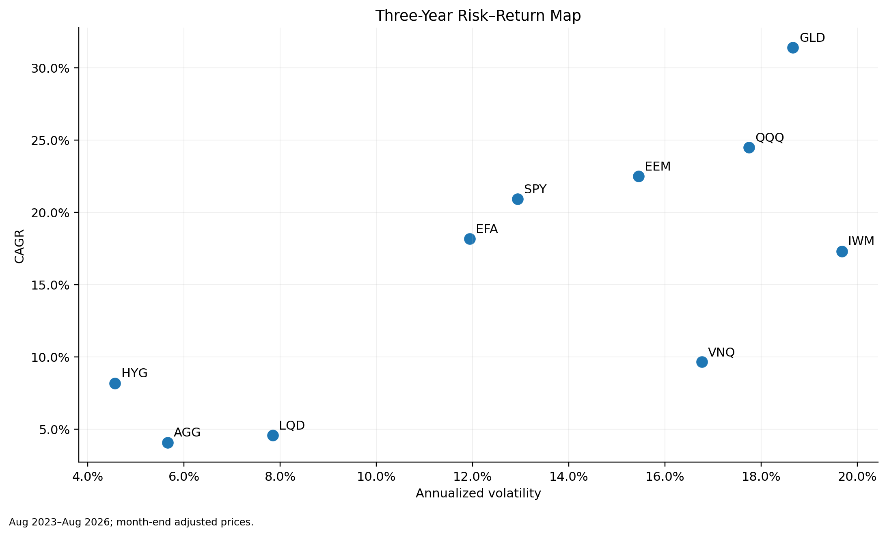
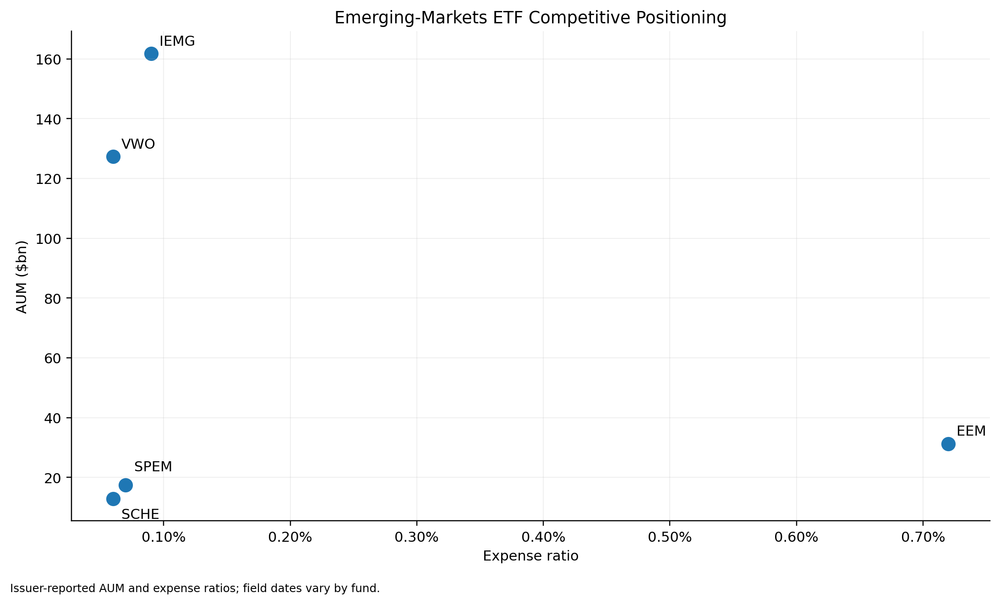
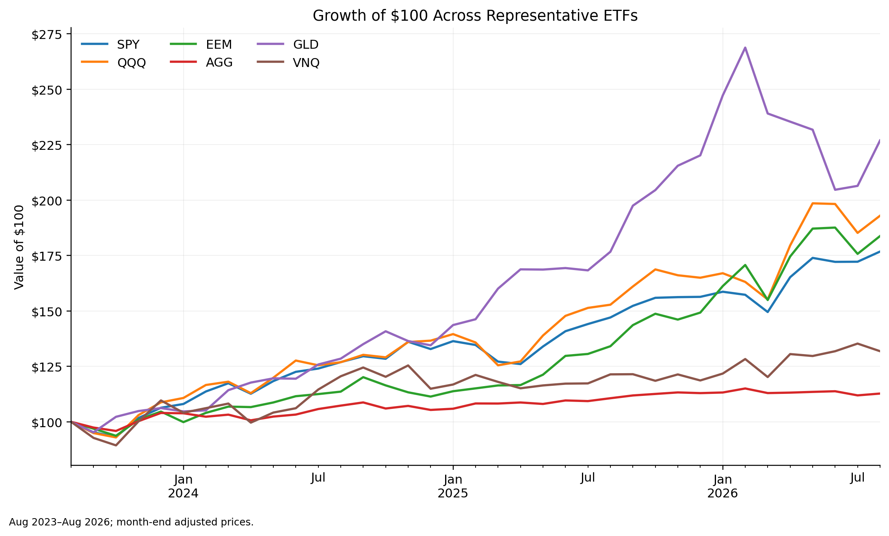
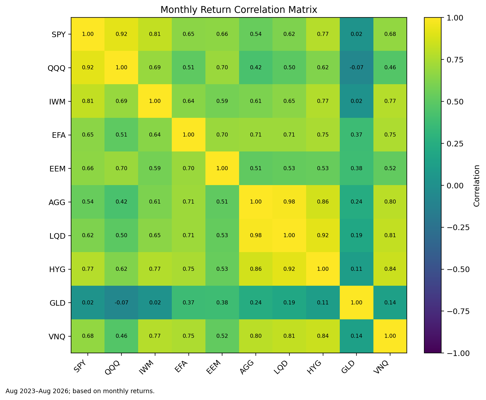

# ETF Product Strategy & Risk Analytics

Independent portfolio project combining ETF competitive analysis, product strategy, and quantitative risk analytics. The objective is to answer a practical product-development question: **does the broad emerging-markets ETF category need another low-cost beta product, or is there a stronger case for differentiated systematic exposure?**

> This is an independent analytical project and is not affiliated with or endorsed by Morgan Stanley or any ETF issuer.

## Project scope

The project has two connected analytical layers:

- **Emerging-markets competitor scan:** EEM, IEMG, VWO, SPEM, and SCHE, compared on AUM, expense ratio, benchmark design, breadth, and positioning.
- **Multi-asset risk analysis:** SPY, QQQ, IWM, EFA, EEM, AGG, LQD, HYG, GLD, and VNQ, evaluated over Aug 2023–Aug 2026 using month-end adjusted prices.

The Excel workbook then translates those findings into a hypothetical product-development case rather than stopping at descriptive analytics.

## Key findings

| ETF | Total Return | CAGR | Ann. Volatility | Sharpe | Max Drawdown | Beta vs SPY |
|---|---:|---:|---:|---:|---:|---:|
| SPY | 76.8% | 20.9% | 12.9% | 1.20x | (7.6%) | 1.00x |
| QQQ | 92.9% | 24.5% | 17.7% | 1.08x | (10.1%) | 1.26x |
| IWM | 61.5% | 17.3% | 19.7% | 0.68x | (19.0%) | 1.24x |
| EFA | 65.0% | 18.2% | 11.9% | 1.09x | (8.4%) | 0.60x |
| EEM | 83.8% | 22.5% | 15.4% | 1.11x | (9.3%) | 0.79x |
| AGG | 12.7% | 4.1% | 5.7% | -0.05x | (4.1%) | 0.24x |
| LQD | 14.4% | 4.6% | 7.8% | 0.04x | (5.9%) | 0.37x |
| HYG | 26.6% | 8.2% | 4.6% | 0.77x | (2.7%) | 0.27x |
| GLD | 126.9% | 31.4% | 18.7% | 1.33x | (23.8%) | 0.03x |
| VNQ | 31.8% | 9.7% | 16.8% | 0.37x | (10.6%) | 0.88x |

The key strategic observations are:

- The selected broad EM peer set is heavily fee-compressed, with four of five funds charging roughly 0.06%–0.09%.
- EEM participated strongly in the sample period, but that does not create a clear case for another broad-beta clone.
- QQQ earned a higher CAGR than SPY, but with materially higher volatility and beta.
- GLD had near-zero monthly-return correlation with SPY in this sample, while still experiencing a large standalone drawdown; diversification and absolute risk are different questions.
- High-yield credit produced more return than core bonds, but its return behavior remained more sensitive to broader risk assets.

## Product-development case

The workbook develops a **hypothetical Emerging Markets Quality & Risk ETF** as a strategy case. The concept is not presented as a launch recommendation. It is used to show how competitive research and quantitative evidence can be translated into testable product design questions.

The proposed research direction emphasizes:

- profitability, balance-sheet strength, and earnings-quality signals;
- country and sector concentration controls;
- minimum liquidity screens;
- portfolio-volatility and drawdown monitoring; and
- commercial testing around demand, fees, distribution, tracking error, capacity, and implementation costs.

## Selected outputs

### Risk-return map


### Emerging-markets competitor positioning


### Growth of $100


### Correlation matrix


## Excel workbook

`ETF_Product_Strategy_Risk_Analytics.xlsx` contains:

- **Dashboard** — executive summary and decision-oriented takeaways
- **Product Landscape** — competitor economics and product positioning
- **Analysis Results** — concise findings and four charts
- **Risk Analytics** — formula-driven return and risk metrics
- **Monthly Prices** — source price history
- **Monthly Returns** — formula-driven monthly return calculations
- **Risk-Free Rates** — FRED DGS3MO month-end inputs with exact observation dates
- **Drawdown Calc** — month-end peak-to-trough calculations
- **Correlation Matrix** — formula-driven cross-asset correlations
- **Strategy Case** — product-development hypothesis and open questions
- **Sources** — source log and data notes

## Reproduce the analysis

```bash
pip install -r requirements.txt
python analysis.py
```

The script reads the bundled files in `data/` and rebuilds the risk metrics, monthly-return file, correlation matrix, and four charts in `outputs/`.

## Repository structure

```text
.
├── ETF_Product_Strategy_Risk_Analytics.xlsx
├── README.md
├── DATA_AUDIT.md
├── METHODOLOGY.md
├── analysis.py
├── requirements.txt
├── data/
│   ├── em_etf_peer_set.csv
│   ├── monthly_adjusted_prices.csv
│   ├── risk_free_monthly.csv
│   └── source_manifest.csv
└── outputs/
    ├── correlation_heatmap.png
    ├── correlation_matrix.csv
    ├── em_competitor_positioning.png
    ├── growth_of_100.png
    ├── monthly_returns.csv
    ├── risk_metrics.csv
    └── risk_return_map.png
```

## Methodology and limitations

Returns are calculated from month-end adjusted prices. Volatility is annualized from monthly returns using `sqrt(12)`. Sharpe and Sortino use month-end observations of the Federal Reserve’s 3-month Treasury constant-maturity yield (FRED DGS3MO), converted to monthly returns and aligned to each ETF return month. Historical VaR is the empirical 5th percentile of monthly returns. Beta is calculated against SPY monthly returns.

The analysis uses only 36 monthly return observations. Month-end drawdown can miss larger intramonth peak-to-trough losses, and historical VaR from a short monthly sample should not be interpreted as an institutional production-risk estimate. Competitor AUM and product fields have different as-of dates because issuers update them on different schedules.

Source URLs and field-level dates are included in `data/em_etf_peer_set.csv`, `data/source_manifest.csv`, and the workbook’s **Sources** tab. Historical price sources are pinned to Digrin’s monthly adjusted-price tables, and the risk-free series is sourced from FRED. See `DATA_AUDIT.md` for the verification log.
